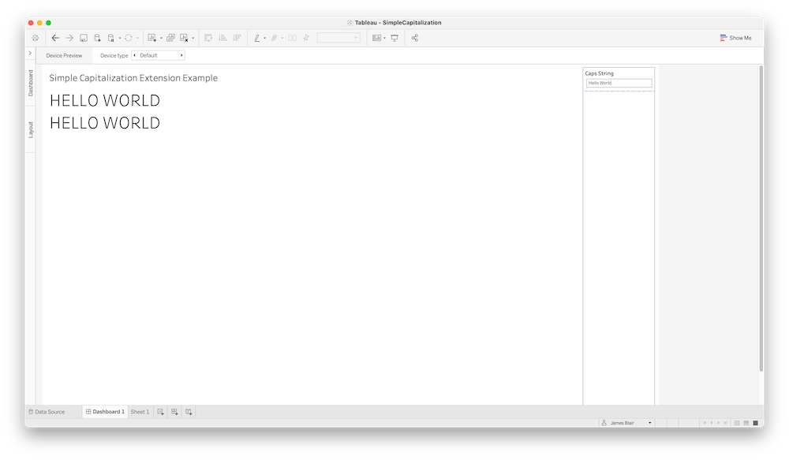
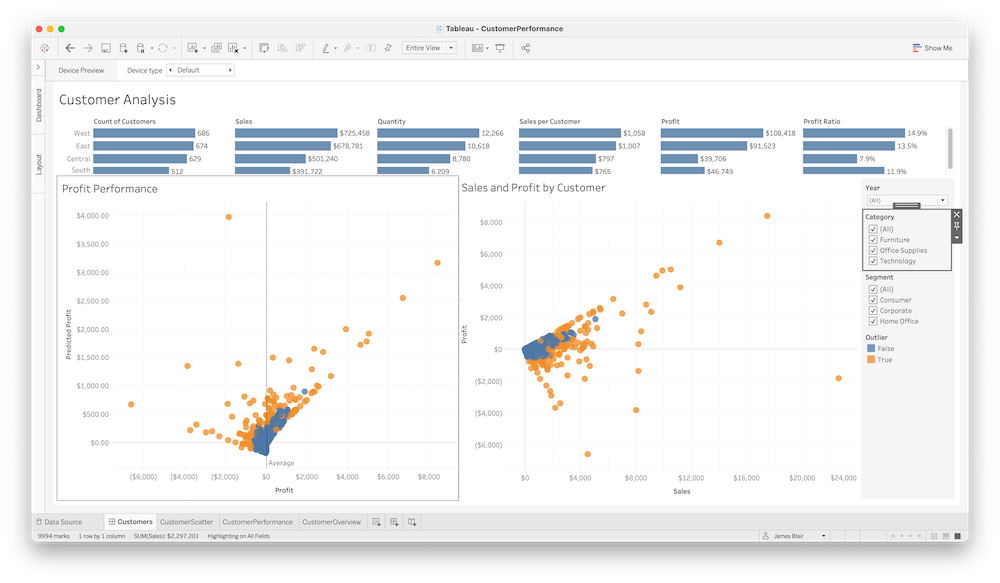

# Tableau Examples

> A collection of examples highlighting how Tableau and RStudio Connect can be used together.

## Setup
In order to fully take advantage of these examples, you'll need access to a
Tableau environment. One option is to register for the [Tableau Developer
Program](https://www.tableau.com/developer), which will give you access to your
own Tableau Online sandbox.

Once you have access to Tableau, you can follow the instrucitons to [configure
Tableau with RStudio
Connect](https://docs.rstudio.com/rsc/integration/tableau/). Each example in
this repository has a Tableau workbook in the `Tableau/` that can used to
showcase the extensions from the example.

### [Capitalize](capitalize/)

A very basic example showing how both Python and R extensions can be used to
capitalize text passed from Tableau.

---
### [Superstore](superstore/)

An example built on top of the Tableau Superstore data showing how R and Python
extensions can be used side by side in the same workbook and even in the same
visualization.

