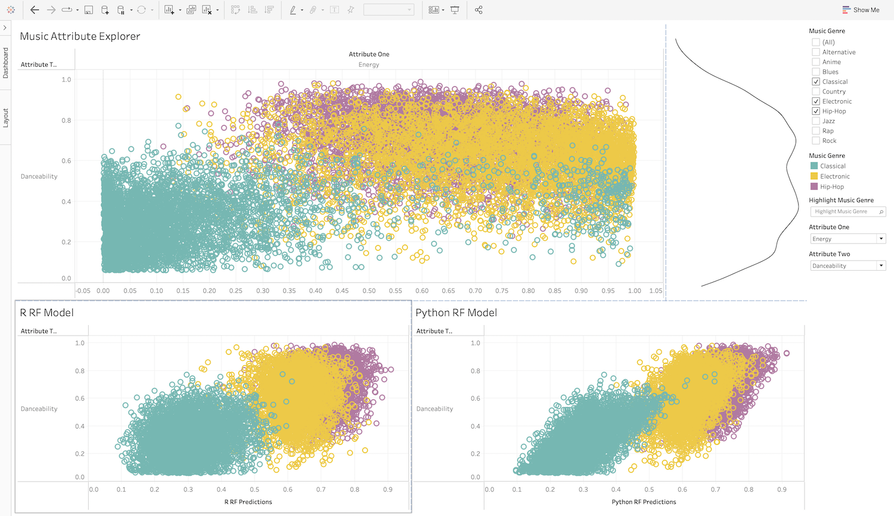

# Music Dashboard

This is a very Tableau dashboard that allows users to explore a [music genre
dataset from
Kaggle](https://www.kaggle.com/datasets/vicsuperman/prediction-of-music-genre).
The end user can select different features for the X and Y axis to determine
potential relationships within the data. Two Tableau Analytics Extensions are
used to compare Random Forest models generated in both R and Python.

## [R Extension](R/plumber/plumber.R)

The R extension used in this workbook takes `x` and `y` input data, trains a
Random Forest, and returns the predicted values based on the training data.

## [Python Extension](Python/app.py)

The Python extension used in this workbook takes `x` and `y` input data, trains
a Random Forest, and returns the predicted values based on the training data.

## [shinytableau](R/shiny/)

Two [shinytableau extensions](https://rstudio.github.io/shinytableau/) are
included that create density plots along the X and Y axis of the main
scatterplot.

## [Tableau Workbook](Tableau/)
The Tableau workbook included in this example contains a main scatterplot and
two subplots showing the residuals from two different Random Forest models.