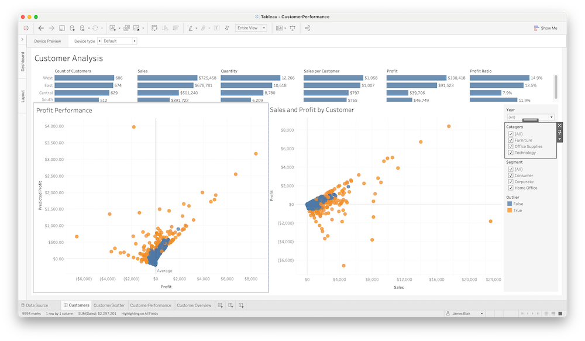

# Superstore

Tableau comes with a built in dataset referred to as Superstore. This dataset represents products, sales, and profits from an imaginary company. The dashboard in this example showcases how R and Python extensions can be used together from the same Tableau Workbook.

## [R Extension](R/plumber.R)

The R extension used in this workbook uses the [`outForest`](https://github.com/mayer79/outForest) package to do outlier detection given a set of sales and profit data. The function returns a logical vector / array indicating whether or not a given observation was identified as an outlier.

This extension is used in the Tableau Workbook to visually identify outliers.

## [Python Extension](Python/app.py)

The Python extension used in this workbook uses a simple [scikit-learn linear model](https://scikit-learn.org/stable/modules/generated/sklearn.linear_model.LinearRegression.html) to predict profit given the following inputs:

* Days to ship actual: How many days did it take an order to ship
* Days to ship scheduled: How many days is it expected to take an order to ship
* Quantity: How many items were in the order
* Sales: How much was the order
* Discount: What was the percentage discount applied to the order

Given this information, the extension returns a predicted profit value. This can be used to compare to actual profit to determine orders and customers that are over / under performing according to profit expectations.

## [Tableau Workbook](Tableau/)
The Tableau workbook included in this example is built off of the default Superstore workbook that is included in Tableau. It contains 3 distinct worksheets:

* CustomerScatter: A view of customers comparing Sales to Profit. The color of each point indicates its outlier status.
* CustomerPerformance: A view of customers comparing Profit to Predicted Profit. The color of each point indicates its outlier status.
* CustomerOverview: View of sales performance broken down by various categories across regions.